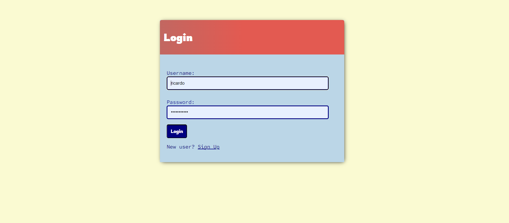
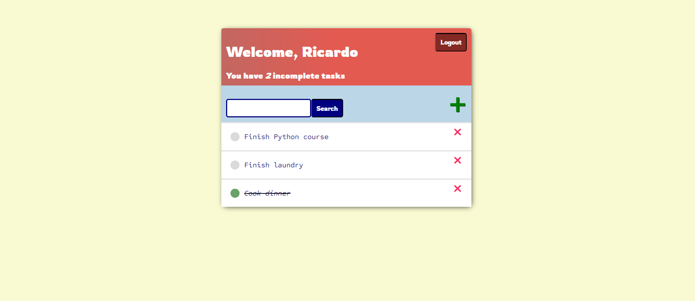
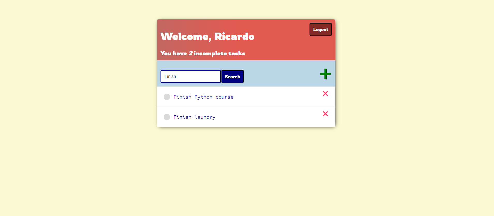
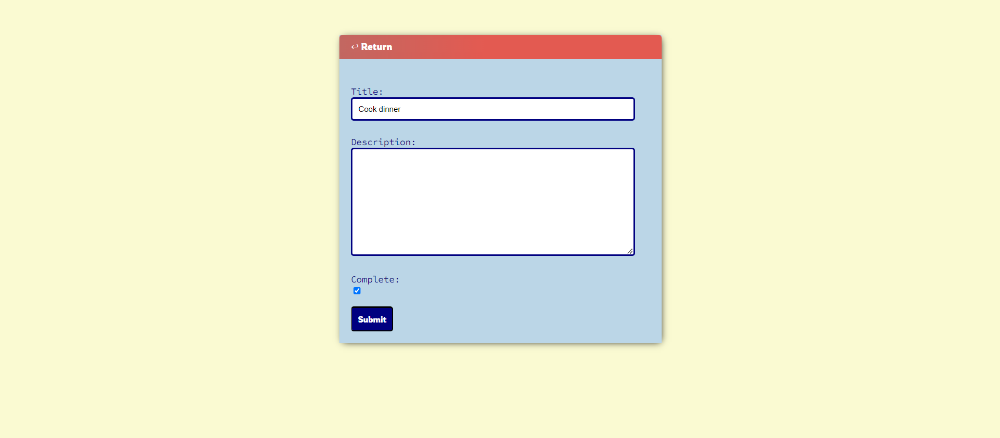
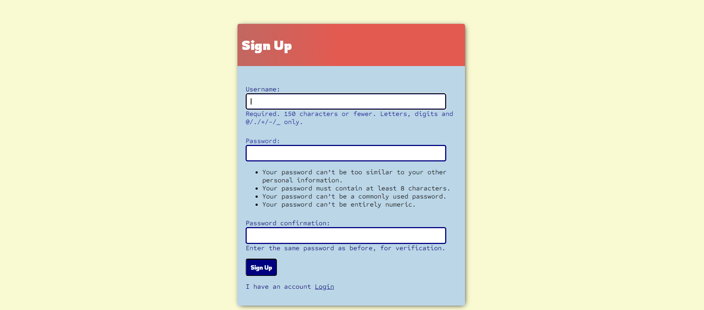

# restaurant-manager
Website built with the <b>Python</b> web framework <b>Python</b>. It allows each user to create, edit and delete tasks that only the author can see and mark as complete to manage them better. Users need to create an account and login with their credentials into the website to access their functionalities.
 
 

| [📖 Features](#features) | [:camera: Screenshots](#screenshots) |
|  -------- | ----------- |

 

## Features

* **User-friendly interface:** Displays three lists with all the types of food, drinks and desserts, allowing the user to easily check the products selected by the client and input how many dishes were ordered of each one.
 
 
* **Detailed costs:** Calculates costs of the food, drinks and desserts, subtotal, tax and the total of everything combined.
 

* **In-built calculator:** Allows the user to perform any operation (+, -, *, /) on numbers containing decimal points.
 

* **Receipt creation:** Creates a receipt with all the data, once calculated the total costs, and allows the user to save it as a .txt file on his own device.
 

 

## Screenshots

